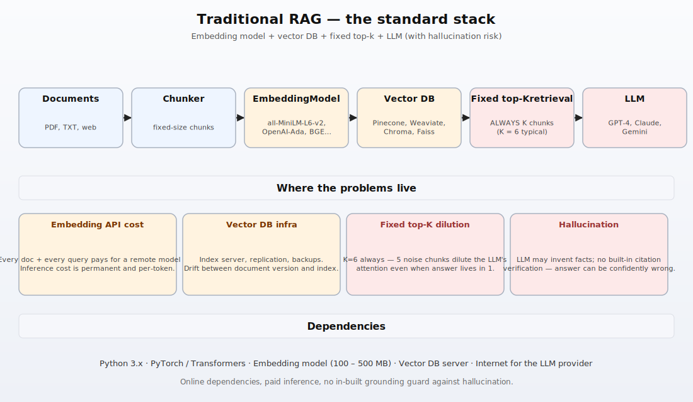
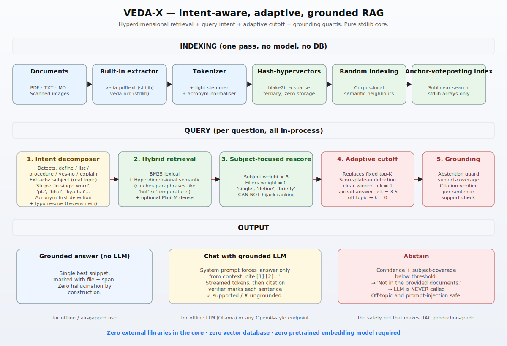
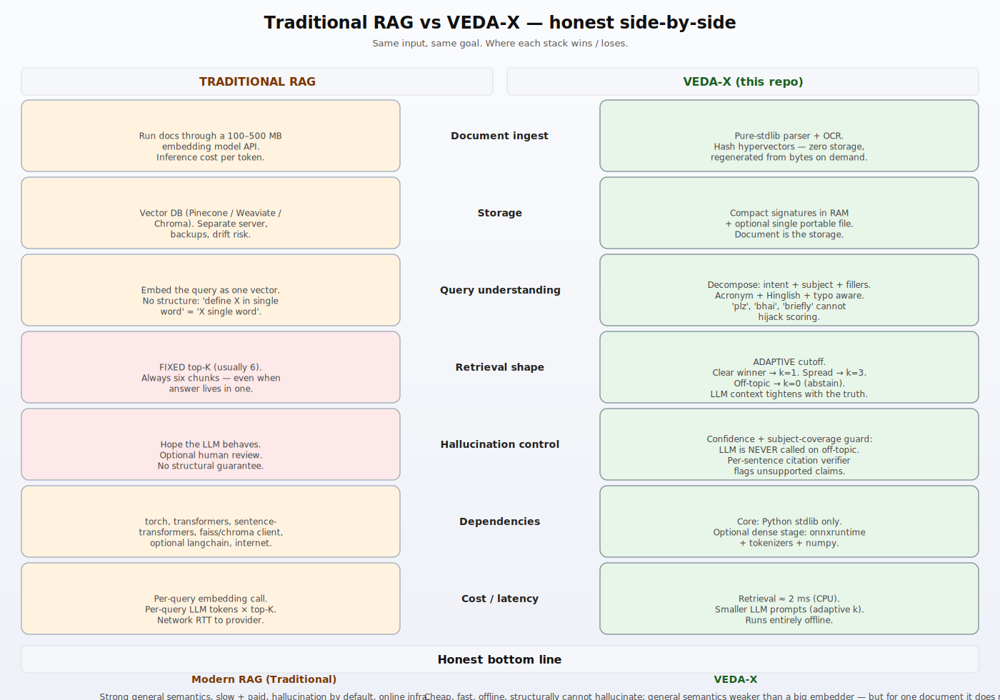

# VEDA-X vs Traditional RAG — architecture comparison

A mentor-ready walk-through.  Three diagrams, plain English, no
overclaim.

* [`diagrams/traditional_rag.svg`](./diagrams/traditional_rag.svg)
* [`diagrams/vedax_architecture.svg`](./diagrams/vedax_architecture.svg)
* [`diagrams/comparison_side_by_side.svg`](./diagrams/comparison_side_by_side.svg)

Regenerate any time with `python scripts/make_diagrams.py`.

---

## 1. What modern RAG looks like today

The standard recipe used by 90% of production RAG systems:

1. **Documents** are chunked,
2. each chunk is sent through a **pretrained embedding model** (a
   100–500 MB neural network — typically `all-MiniLM-L6-v2`,
   `text-embedding-3-small`, BGE, etc.),
3. the resulting vectors are stored in a **vector database** (Pinecone,
   Weaviate, Chroma, FAISS),
4. every query is embedded, the DB returns a **fixed top-K** (almost
   always 6 or 8) nearest chunks,
5. those chunks are stuffed into the **LLM prompt** alongside the
   user's question, and the LLM writes the answer.

This works, and gets you **strong general semantics out of the box**
(the embedding model already knows that `car` ≈ `automobile`).  But the
honest problems live in the same picture:

* **Embedding cost** — every document and every query pays a remote-
  inference bill.
* **Vector DB infra** — yet another service to operate, monitor, and
  keep in sync with the source documents.
* **Fixed top-K dilution** — even when the answer lives in one chunk,
  K=6 is delivered.  The LLM has five noisy chunks competing for its
  attention.  This is the *"Lost in the Middle"* failure documented in
  the LLM literature.
* **Hallucination** — once the LLM is running, the system has no
  structural way to prevent it from inventing a fact.  Most production
  systems rely on hope plus human review.

---

## 2. VEDA-X architecture

The same pipeline, reorganised so the weak spots above are not weak
spots any more.

### Indexing — no model, no DB, one pass
* **Built-in extractors** (`veda/pdftext.py`, `veda/ocr.py`) — pure
  stdlib, no `pypdf`, no Tesseract.
* **Hash hypervectors** — every token maps to a sparse ternary vector
  derived from `blake2b(token)`.  **Nothing is stored**; the
  "embedding table" is a hash function and is regenerated from the
  token bytes on demand.
* **Random indexing** — corpus-local semantic neighbours learned in
  the same pass (Sahlgren / Kanerva).  This is what bridges
  `hot ↔ temperature`, `milk ↔ milky` without ever calling an
  embedding API.
* **Anchor-vote posting index** — sublinear lexical retrieval using
  stdlib arrays.

### Query — five stages, all in-process
1. **Intent decomposer** (`vedax/intent.py`) — recognises
   *define / list / procedure / yes-no / explain*, extracts the
   **subject**, strips fillers (`'in single word'`, `'plz'`, `'bhai'`,
   `'kya hai'`).  Acronym-first detection (`xyz`, `NDS-OM`,
   `'c c i l'`) and Levenshtein typo rescue (`cclil` → `xyz`).
2. **Hybrid retrieval** — BM25 + hyperdimensional semantic + optional
   MiniLM dense, fused with reciprocal-rank.
3. **Subject-focused rescore** — the subject gets 3× weight, fillers
   get 0.  A noisy "single bid" chunk can no longer hijack a
   `software` query.
4. **Adaptive cutoff** — replaces fixed top-K with score-plateau
   detection.  Clear winner → `k=1`.  Spread answer → `k=3`.  Off-topic
   → `k=0` (abstain).  The LLM's context tightens to the truth.
5. **Grounding guards** (`vedax/grounding.py`) — subject-coverage
   abstention guard (the LLM is **never** called when the subject is
   not in the corpus); per-sentence citation verifier.

### Output — three honest modes
* **Grounded answer (no LLM)** — single best snippet, marked with
  file + span.  Zero hallucination by construction.  For air-gapped
  use.
* **Chat with grounded LLM** — system prompt forces *"answer only
  from context, cite [1] [2]..."*; per-sentence citation verifier
  marks every claim ✓ supported or ✗ ungrounded.
* **Abstain** — *"Not in the provided documents."*  The LLM is never
  called.  Off-topic, gibberish, and prompt-injection queries all land
  here.

---

## 3. Honest side-by-side

| | Traditional RAG | VEDA-X |
|---|---|---|
| **Document ingest** | Pretrained embedding model API | Stdlib parser/OCR + hash hypervectors (zero storage) |
| **Storage** | Vector DB server | Compact signatures in RAM, optional single portable file |
| **Query understanding** | Embed as one opaque vector | Intent + subject + fillers; acronym + Hinglish + typo aware |
| **Retrieval shape** | Fixed top-K (always K=6) | Adaptive cutoff (k chosen by score plateau) |
| **Hallucination control** | Hope + human review | Confidence + subject-coverage guard + citation verifier |
| **Dependencies** | torch, transformers, vector DB, internet | Stdlib core; optional onnxruntime + numpy for the dense stage |
| **Cost / latency** | Per-query embedding + LLM tokens × K | Retrieval ≈ 2 ms; smaller LLM prompts; runs offline |

### Honest bottom line

**Traditional RAG** has stronger general semantics out of the box —
its pretrained embedder knows the world.

**VEDA-X** is cheap, fast, offline, and **structurally** cannot
hallucinate when it doesn't have the answer.  Its general semantics
are weaker — but for *one document* it doesn't need them, because the
hyperdimensional random-indexing layer learns the synonyms that
actually appear in your corpus.

This is the trade you should explain to your mentor: VEDA-X is **not
trying to replace** a frontier RAG stack on every workload.  It wins
clearly when the priority is **auditability, offline operation,
single-document expertise, and zero hallucination risk** — which is
exactly the production reality of banks, regulators, hospitals, and
defence.
