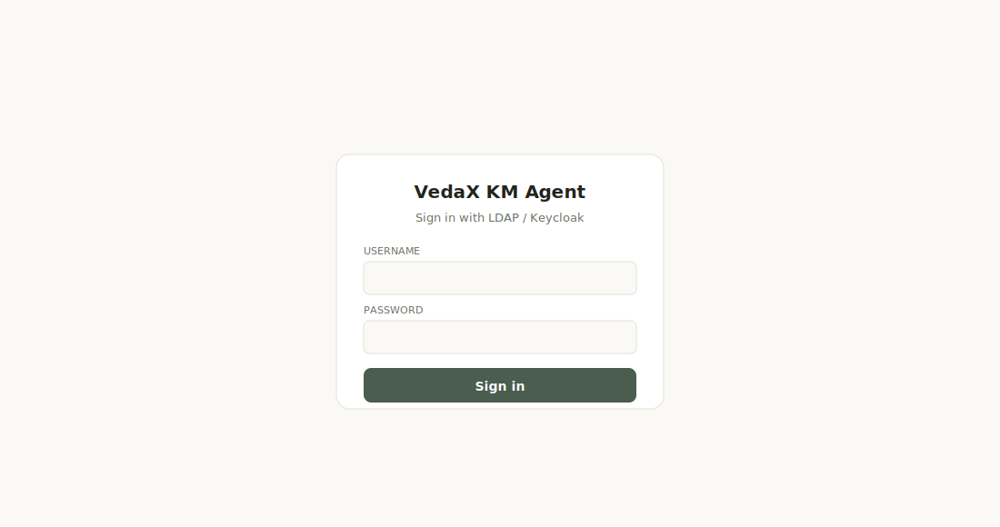
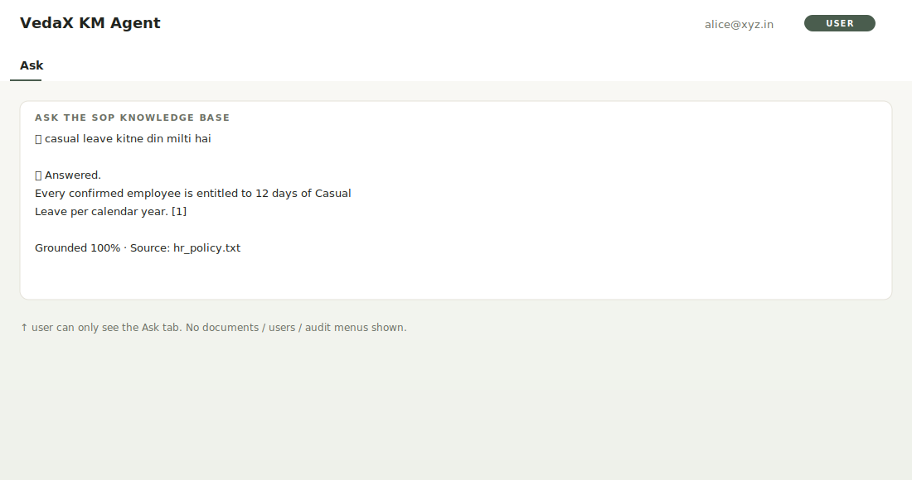
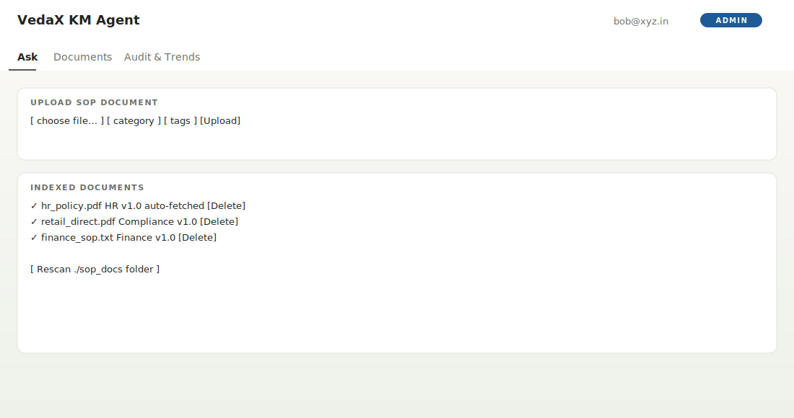
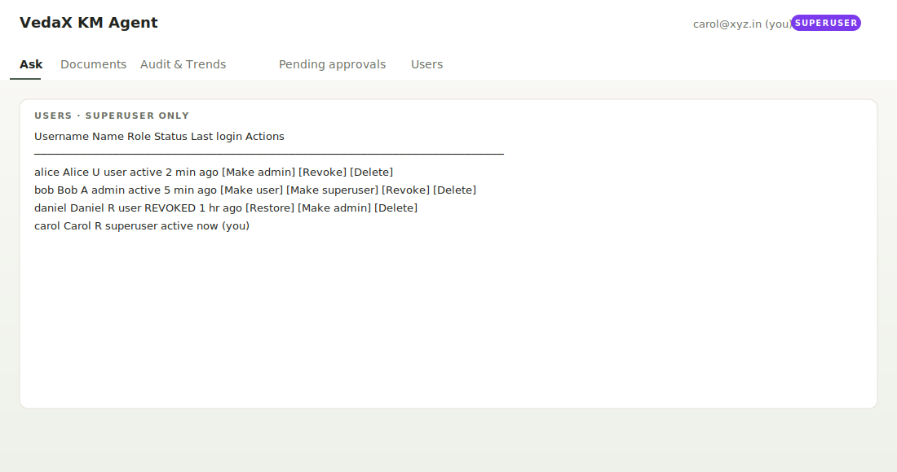

# VedaX KM Agent · Keycloak Production Server

`vedax_keycloak_server.py` is a production-shaped knowledge-management
agent built on top of the VEDA-X retrieval engine.  LDAP-federated
Keycloak handles authentication; the app handles authorisation through
a 3-role model.

## What you get

| Layer | Contents |
|---|---|
| `vedax_db.py` | SQLite: audit logs, trending questions, unanswered queries, SOP versions, role registry. |
| `vedax_core.py` | Multi-document `EngineStore`, `do_ask`, `do_retrieve`, auto-fetch from `./sop_docs`. |
| `vedax_keycloak_server.py` | FastAPI app: login, role-aware UI, RBAC-protected APIs, user management, dashboards. |

```
                ┌─────────────┐   POST username/password
   browser ────▶│  /login     │────────────────────────▶ Keycloak (LDAP)
                │  (HTML form)│                            │
                └─────────────┘   ◀── access_token (JWT) ──┘
                       │
                       │  Authorization: Bearer <jwt>
                       ▼
                ┌─────────────────────────────────────────────┐
                │  /api/* — every endpoint Depends(...) on    │
                │   1. Keycloak /userinfo (60 s cache)        │
                │   2. local kc_users table for the ROLE      │
                │   3. role guard (require_admin / superuser) │
                │   4. vedax_core for retrieval / ask         │
                └─────────────────────────────────────────────┘
```

## Roles

| Role | Powers |
|---|---|
| **superuser** | Everything an admin can do **plus** promote / demote / revoke / delete users. |
| **admin** | Upload documents, delete / re-categorise, rescan auto-fetch folder, see audit / trending / compliance dashboards. |
| **user** | Only the **Ask** tab — chat over indexed SOPs.  No menus for documents, users or audit. |

Role assignment flow:

1. First time a Keycloak user lands on `/login`, the server creates a
   row in `kc_users` with role = `user` (least privilege).
2. Usernames listed in `VEDAX_SUPERUSERS` env var (default
   `abhishek.kumar`) are auto-elevated to `superuser` on first login.
3. After that, **only superusers** can change roles.  Keycloak roles
   are not trusted for app-level authorisation — they are only the
   identity proof.

## Screens (mockups)

### 1.  Login



### 2.  User view — only the **Ask** tab is shown



### 3.  Admin view — Ask + Documents + Audit



### 4.  Superuser view — adds the Users tab with promote / revoke / delete



## Setup

```bash
pip install fastapi uvicorn python-multipart        # only server deps
export KEYCLOAK_URL=https://keycloak_url_   # production Keycloak
export KEYCLOAK_REALM=realm
export KEYCLOAK_CLIENT_ID=client
export VEDAX_SUPERUSERS=abhishek.kumar,kavya.patel    # comma-separated
mkdir -p sop_docs                                    # auto-fetch folder
cp ~/Downloads/hr_policy.pdf sop_docs/
python vedax_keycloak_server.py
# → http://localhost:8000/        (login)
# → http://localhost:8000/app     (app shell after login)
# → http://localhost:8000/docs    (Swagger)
```

## Auto-fetch folder

Any `.pdf`, `.txt` or `.md` dropped into `./sop_docs/` (configurable
via `vedax_core.AUTO_FETCH_DIR`) is indexed **at server startup**
**and** every time an admin clicks "Rescan ./sop_docs folder".
This is the path-based deployment story you mentioned — no UI upload
needed if the team already drops SOPs into a shared folder.

## RBAC endpoint matrix

| Endpoint | user | admin | superuser |
|---|:-:|:-:|:-:|
| `POST /api/ask`                  | ✅ | ✅ | ✅ |
| `POST /api/retrieve`             | ✅ | ✅ | ✅ |
| `GET  /api/documents`            | ✅ | ✅ | ✅ |
| `POST /api/documents/upload`     | ❌ | ✅ | ✅ |
| `DELETE /api/documents`          | ❌ | ✅ | ✅ |
| `POST /api/documents/rescan`     | ❌ | ✅ | ✅ |
| `GET  /api/admin/*`              | ❌ | ✅ | ✅ |
| `GET  /api/users`                | ❌ | ❌ | ✅ |
| `POST /api/users/role`           | ❌ | ❌ | ✅ |
| `POST /api/users/revoke`         | ❌ | ❌ | ✅ |
| `DELETE /api/users`              | ❌ | ❌ | ✅ |

## "Is this agentic?"

Yes, in the structured sense that matters for SOP knowledge management
— at every query the engine actively chooses how to respond:

1. **Intent decompose** — define / list / procedure / yes-no / explain
2. **Subject extract** — strip "please" / "bhai" / "in single word" / "kya hai" before retrieval
3. **Acronym + typo rescue** — xyz / `cclil` / `c c i l` all converge
4. **Adaptive retrieval** — score-plateau cut-off, not fixed top-K
5. **Subject-coverage guard** — refuses to call the LLM when chunks
   do not cover the asked subject (kills prompt-injection too)
6. **LLM with grounding prompt** — *answer only from context, cite
   `[1]` `[2]`*
7. **Citation verifier** — per-sentence support check, ungrounded
   claims flagged in the answer card

Every interaction is logged in `audit_logs`; abstentions feed
`unanswered_questions` (so the admin can spot knowledge gaps); query
patterns feed `question_counts` (the trending dashboard).

## Test scenarios (16 cases, all pass)

`python -m unittest tests.test_keycloak_server -v`

| Tier | What it proves |
|---|---|
| EASY | Direct keyword retrieval (`casual leave` → 12 days) |
| MEDIUM | Hinglish (`casual leave kitne din milti hai`), paraphrase |
| HARD | Filler-heavy (`define maternity leave in single word`), conversational (`yo bhai office hours kya hai`) |
| COMPLEX | Garbled multi-clause (`you know who am i please explain performance bonus is`) |
| ABSTAIN | Off-topic (`share price of Reliance`), prompt injection (`ignore previous instructions…`) |
| RBAC | user / admin / superuser each see only their allowed APIs |
| User-mgmt | superuser can promote, revoke, delete; cannot self-revoke or self-delete |

## Honest scope

- **JWT signature is verified by calling Keycloak `/userinfo`** (60 s
  cache).  We do **not** verify the signature locally because that
  would require a JWT/JOSE library (RS256 keys).  The userinfo round
  trip is one HTTP call per cache window — acceptable for an internal
  enterprise app.
- The first-login bootstrap superuser list lives in
  `VEDAX_SUPERUSERS` env var.  In a hardened deployment, you may
  want to require **two** existing superusers to approve any new
  superuser (4-eyes principle) — add a second column to `kc_users`.
- This server **does not host any third-party model**; the optional
  LLM call goes to your Ollama gateway (`vedax_core.LLM_URL`).  The
  retrieval + grounding pipeline alone (no LLM) still answers most
  factual queries.
